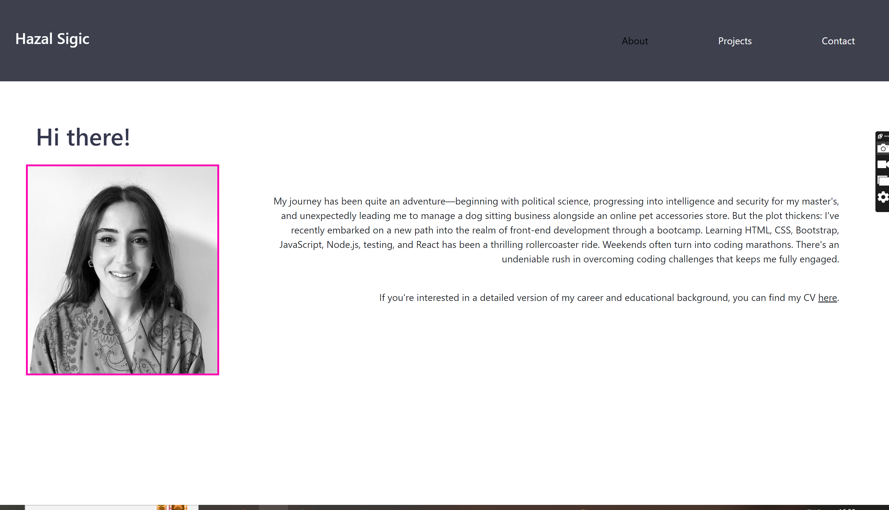

# Portfolio (React)

## Description
This website represent my portfolio. It includes a photo of me, a short description of my background as well as the recent projects I've worked on. There is also a contact page for possible employers. The website can be reach through this <a href="https://hazalsigic.netlify.app/" target="_blank">link</a>.

## Installation
N/A

## Visuals

## Usage
Potential employers lend on the home page where they can read a summary about my background with a cv attached. They can also render through the projects I got involved. If they would like to get in contact, the contact page includes my email address, github profile and LinkedIn profile. 
## Contributing
N/A

## License
Please refer to the LICENCE in the repo.
